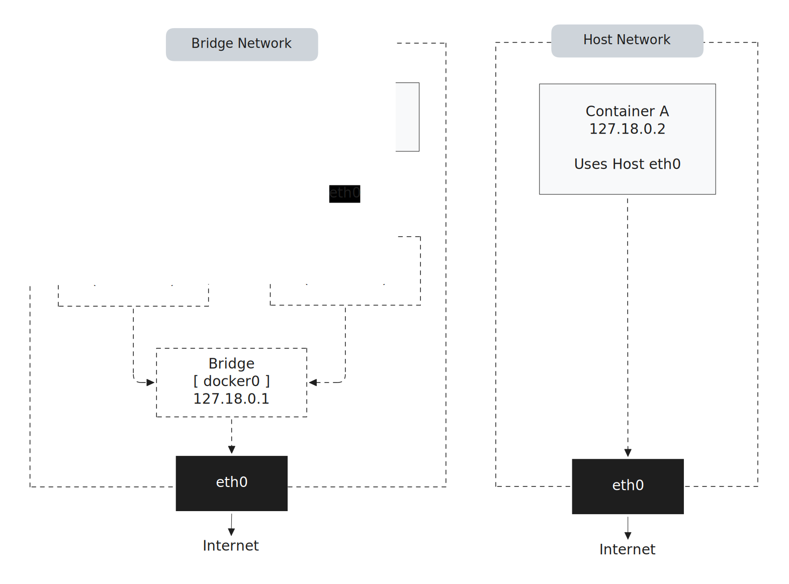

*This project has been created as part of the 42 curriculum by dbarba-v ([d3bvstack on github.com](https://github.com/d3bvstack/))*

# Inception

[](https://www.php.net/) [](https://wordpress.org/) [](https://www.docker.com/) [](https://www.nginx.com/) [](https://mariadb.org/)

Containerized WordPress infrastructure for the 42 Inception project.

This repository builds a three-service stack with Docker Compose:

- NGINX as the only public entrypoint (HTTP + HTTPS)
- WordPress + PHP-FPM as the application runtime
- MariaDB as the database backend

The stack is intentionally segmented by network into front and back-end networks, data persists on the host via volumes, and keeps credentials like passwords, logins and certificates in Docker secrets.

[](.doc/InceptionOverview-d3bvstack.png)

## Documentation

- [DEV_DOC](DEV_DOC.md): Technical developer documentation covering architecture, build flow, and internal implementation details.
- [USER_DOC](USER_DOC.md): End-user guide for setup, operation, and day-to-day usage of the project.

## Project Goal

The objective is to deploy and operate a realistic web platform while applying container best practices:

- Each service should do one thing only.
- Docker images build exactly the same way every time.
- Compose file clearly maps out how everything connects.
- Keep settings and passwords separate from the app code.
- Data persists after the container stops.

## Table of contents

- [Documentation](#documentation)
- [Architecture Overview](#architecture-overview)
- [Project Description](#project-description)
- [Virtual Machines vs Docker](#virtual-machines-vs-docker)
- [Docker Networks vs Host Network](#docker-networks-vs-host-network)
- [Docker Secrets vs Environment Variables](#docker-secrets-vs-environment-variables)
- [Docker Volumes vs Bind Mounts](#docker-volumes-vs-bind-mounts)
- [Quick start](#quick-start)
- [Operational commands](#operational-commands)
- [Configuration model](#configuration-model)
- [Secrets model](#secrets-model)
- [Persistence model](#persistence-model)
- [Networking model](#networking-model)
- [Request flow](#request-flow)
- [Troubleshooting](#troubleshooting)
- [Repository map](#repository-map)
- [Learning resources](#learning-resources)

## Architecture Overview

[](.doc/InceptionOverview-d3bvstack.png)

| Service | Responsibility | Exposed ports | Depends on | Persistent path |
|---|---|---|---|---|
| NGINX | TLS decryption, static files serving, reverse proxy to PHP-FPM | `80`, `443` | `wordpress-php` (healthy) | `/var/www` |
| WordPress + PHP-FPM | WordPress runtime and PHP processing | internal `9000` | `mariadb` (healthy) | `/var/www` |
| MariaDB | Relational database engine | internal `3306` | none | `/var/lib/mysql` |

Operational characteristics:

- All services restart automatically with `restart: always`
- Startup order is gated by health checks (`depends_on.condition: service_healthy`)
- Container logs use capped json-file rotation (`10m`, `3` files)

## Project Description

This project packages a complete WordPress deployment into reproducible containers and orchestrates them with Docker Compose.

Instead of installing web server, PHP runtime, and database directly on the host, each concern runs in an isolated service:

- NGINX receives external traffic and handles TLS.
- WordPress + PHP-FPM processes PHP requests.
- MariaDB stores persistent database data.

The design prioritizes separation of concerns, secure secret handling, and deterministic operations across rebuilds.

## Virtual Machines vs Docker

| Aspect | Virtual Machines | Docker Containers |
|---|---|---|
| Isolation boundary | Hardware virtualization + full guest OS | Process isolation using Linux namespaces, cgroups, union filesystems |
| Startup time | Slower (boots a full OS, init system, drivers) | Faster (just starts a process in a sandbox) |
| Resource overhead | High: each VM duplicates kernel, OS, drivers | Low: containers share host kernel, only app + deps |
| Service discovery | Manual IP/hostname management | Built-in DNS by service name |
| Image lifecycle | Heavyweight, slow to rebuild | Fast, reproducible, layered builds |
| Fit for this project | Overkill for 3 tightly-coupled services | Ideal for rapid iteration and reproducibility |

**How Docker works:**

Docker containers use the host’s Linux kernel but isolate each service using:

- **Namespaces:** Restrict what a process can see (filesystem, network, users, PIDs)
- **cgroups:** Limit and account for CPU, memory, and I/O usage
- **Union filesystems:** Layer images for efficient storage and fast rebuilds

This means containers start in seconds, use less memory, and images stay small because they only include the application and its direct dependencies.

**Why containers are better for this project:**

- You can destroy and rebuild the entire stack in seconds with one command.
- Each service is isolated but shares the host kernel, so resource overhead is minimal.
- The environment is reproducible: anyone can clone the repo and get the same result, without worrying about host OS drift or VM image mismatches.
- Networking and service discovery are automatic.

[](.doc/vmVScontainer-d3bvstack.png)

## Docker Networks vs Host Network

| Aspect | User-defined Bridge Networks | Host Network |
|---|---|---|
| Service discovery | Built-in DNS by service name | No Docker DNS boundary |
| Isolation | Segmented virtual networks per role | Shares host network stack directly |
| Security | Easier least-privilege connectivity | Weaker isolation |
| Fit for this stack | Enables frontend/backend split | Not suitable for project goals |

By default, Docker can place containers on the default `bridge` network, but that model is not ideal for this project.

Using `network_mode: host` is even less suitable here. In host mode, containers share the host network namespace directly, so you lose most network-level isolation and port separation that this project is designed to demonstrate.

[](.doc/bridgeVShost-d3bvstack.png)

This repository instead uses user-defined bridge networks with explicit IPAM configuration (`srcs/networks-compose.yml`), which gives:

- deterministic subnets and gateways
- service-name DNS resolution on each network
- clear, enforceable boundaries between edge and data tiers

Implementation in this project:

- `frontend_net`: NGINX and WordPress/PHP-FPM
- `backend_net`: WordPress/PHP-FPM and MariaDB

Traffic policy enforced by attachment:

- NGINX is attached only to `frontend_net`.
- MariaDB is attached only to `backend_net` (`internal: true`).
- WordPress/PHP-FPM is the only service attached to both networks.

This creates a controlled path: client -> NGINX -> PHP-FPM -> MariaDB. There is no direct route from NGINX to MariaDB, and MariaDB is not reachable from the public-facing side.

Result: MariaDB stays unreachable from the public-facing side, and NGINX never talks to the database directly.


## Docker Secrets vs Environment Variables

| Aspect | Environment Variables (`.env`, `env_file`) | Docker Secrets |
|---|---|---|
| Best use | Non-sensitive configuration | Credentials and sensitive identity data |
| Exposure model | Process environment and inspect metadata | Read-only files in `/run/secrets` |
| Rotation discipline | Often ad hoc | Explicit file-backed inputs |
| Fit for this stack | Ports, names, image tags, paths | DB credentials, WordPress user/admin data, SSL key/cert |

**Environment variables (`.env` and `env_file`):**

A `.env` file contains key-value pairs for general configuration: domain names, port numbers, image tags, paths, database names—values that change across environments but are not sensitive.

Docker Compose interpolates values from `srcs/.env` into Compose fragments at runtime, which makes the infrastructure configurable without modifying the Compose file itself.

This project also uses service-level `env_file` configurations (e.g., `srcs/requirements/nginx/config.env`). These are not for Compose interpolation but for setting container-level environment variables at runtime via the `env_file` directive. This separation keeps service-specific config separate from global infrastructure parameters.

**Why credentials should never be in environment variables:**

Putting a database password in a `.env` file or `env_file` creates multiple risks:

- The value ends up in the environment of every process that reads it.
- It may be accidentally committed to the repository.
- It is visible to anyone who runs `docker inspect` on the container.
- Environment variables are often logged or exported by default in many software packages.

**Docker Secrets:**

Docker Secrets provide a secure alternative:

- Secrets are defined as files on the host.
- Compose mounts them read-only inside containers at `/run/secrets/<name>`.
- Only services explicitly granted access to a secret can see it.
- Nothing ends up in environment variables, image layers, or `docker inspect` output.

**Secrets used in this project:**

| Secret file | Purpose | Handling |
|---|---|---|
| `secrets/mariadb/mysql_root_password.secret` | MariaDB root password | Interactive prompt on first run |
| `secrets/mariadb/mysql_wp_db_admin_password.secret` | MariaDB WordPress database user password | Interactive prompt on first run |
| `secrets/mariadb/mysql_wp_db_admin_username.secret` | MariaDB WordPress database user name | Interactive prompt on first run |
| `secrets/wordpress-php/wp_admin_username.secret` | WordPress admin account username | Interactive prompt on first run |
| `secrets/wordpress-php/wp_admin_password.secret` | WordPress admin account password | Interactive prompt on first run |
| `secrets/wordpress-php/wp_admin_mail.secret` | WordPress admin email address | Interactive prompt on first run |
| `secrets/wordpress-php/wp_user_username.secret` | WordPress regular user account username | Interactive prompt on first run |
| `secrets/wordpress-php/wp_user_password.secret` | WordPress regular user account password | Interactive prompt on first run |
| `secrets/wordpress-php/wp_user_mail.secret` | WordPress regular user email address | Interactive prompt on first run |
| `secrets/ssl/<domain>.cert` | SSL/TLS certificate | Auto-generated if missing |
| `secrets/ssl/<domain>.key` | SSL/TLS private key | Auto-generated if missing |

Missing secrets are created by `make secrets`:

- **Credential files** (passwords, usernames, emails): you are prompted interactively to enter values, then the files are created.
- **SSL certificate and key**: automatically generated using `openssl req -x509` with a self-signed approach if missing.

In this implementation, general configuration stays in `srcs/.env` and per-service `config.env` files, while secrets are mounted from files in `srcs/secrets-compose.yml`. This keeps sensitive values completely out of image layers, environment variables, and normal inspection flows.

## Docker Volumes vs Bind Mounts

| Aspect | Bind Mounts | Docker-managed Volumes |
|---|---|---|
| Backing storage | Explicit host path | Docker volume abstraction |
| Portability | Depends on host path conventions | More portable by default |
| Operational control | Direct host visibility and control | Cleaner lifecycle via Docker tooling |
| Fit for this stack | Good when host path is intentionally fixed | Good for generic persistence patterns |

This project combines both behaviors: named volumes (`database_data`, `wordpress_data`) are defined in compose and mapped to fixed host paths via `driver_opts`.

Why this matters:

- persistent data survives container rebuilds
- data location remains explicit for backup and inspection
- cleanup semantics are clear (`make down` keeps data, `make clean` removes it)

## Instructions

### 1. Prerequisites

- Linux host with Docker Engine and Docker Compose plugin available
- A user account that can run Docker commands
- Write access to `/home/$USER/data` (used by persistent bind mounts)

### 2. Clone and move into the project

```sh
git clone https://github.com/d3bvstack/Inception.git
cd Inception
```

### 3. Add local DNS entries

Add your domain to `/etc/hosts` so local requests resolve to your machine:

```text
127.0.0.1  <your_login>.42.fr
127.0.0.1  www.<your_login>.42.fr
```

For the default repository values, this is:

```text
127.0.0.1  dbarba-v.42.fr
127.0.0.1  www.dbarba-v.42.fr
```

### 4. Configure environment values

Review and edit `srcs/.env` as needed. The file controls image names, ports, paths, network ranges, and service variables.

### 5. Start the stack

```sh
make
```

What happens on first run:

- Missing credential secret files are requested interactively
- Missing SSL key/certificate are auto-generated (self-signed)
- Data directories are created under `/home/$USER/data/...`
- Compose starts all services in detached mode

### 6. Open the site

- `https://<your_login>.42.fr`
- `https://<your_login>.42.fr/wp-admin`
- `https://<your_login>.42.fr/wp-login.php`

## Operational commands

The Makefile is the primary interface.

| Command | Purpose |
|---|---|
| `make` / `make all` / `make up` / `make inception` | Start all services |
| `make stop` | Stop running containers |
| `make down` | Stop and remove containers + networks (keeps volumes/data) |
| `make restart` | Restart all services |
| `make ps` | Show service status |
| `make shell SERVICE=<name>` | Open `/bin/sh` inside a running container |
| `make config` | Print the fully resolved Compose configuration |
| `make build` | Rebuild images (uses `ENV`, default `srcs/.env`) |
| `make secrets` | Check/create secret files |
| `make clean` | Remove containers, volumes, and host data folders |
| `make fclean` | `clean` + remove images |
| `make re` | Full rebuild (`fclean` then `all`) |
| `make help` | Print command help |

## Configuration model

Configuration is split by concern:

- `srcs/.env`: compose interpolation and global infrastructure variables
- `srcs/requirements/*/config.env`: per-service runtime environment values
- `srcs/secrets-compose.yml`: file-backed Docker secrets declarations

Important notes:

- Compose interpolation values in `srcs/.env` affect all included Compose fragments.
- Secret values are not loaded from `.env`; they are mounted from files in `/run/secrets`.
- Build-time arguments are passed explicitly from compose service definitions.

## Secrets model

Credentials and identity data are stored as files under `secrets/` (repository root). Missing files are created by `make secrets`.

Required secret files:

```text
secrets/
├── mariadb/
│   ├── mysql_root_password.secret
│   ├── mysql_wp_db_admin_password.secret
│   └── mysql_wp_db_admin_username.secret
├── wordpress-php/
│   ├── wp_admin_mail.secret
│   ├── wp_admin_password.secret
│   ├── wp_admin_username.secret
│   ├── wp_user_mail.secret
│   ├── wp_user_password.secret
│   └── wp_user_username.secret
└── ssl/
    ├── <domain>.cert
    └── <domain>.key
```

Behavior of secret bootstrap:

- Credential files: prompted interactively via `/dev/tty`
- SSL files: generated automatically with `openssl req -x509`
- Non-interactive shells without existing credential files: fail fast with an explicit error

## Persistence model

The project uses named volumes mapped to host bind locations through `driver_opts`.

| Volume | Container path | Host path |
|---|---|---|
| `database_data` | `/var/lib/mysql` | `/home/${USER_LOGIN}/data/mariadb` |
| `wordpress_data` | `/var/www` | `/home/${USER_LOGIN}/data/wordpress` |

Implications:

- Data survives container recreation and image rebuilds.
- `make down` keeps persisted data.
- `make clean` and `make fclean` remove persisted data directories.

## Networking model

Two bridge networks enforce separation of concerns:

- `frontend_net` (public-facing): NGINX + WordPress/PHP-FPM
- `backend_net` (internal only): WordPress/PHP-FPM + MariaDB

Security and reachability outcomes:

- MariaDB is not connected to the public-facing network.
- NGINX has no direct route to MariaDB.
- WordPress/PHP-FPM is the only service that bridges both layers.

## Request flow

1. Client connects to NGINX on `443`.
2. NGINX serves static assets directly when possible.
3. PHP requests are forwarded to WordPress/PHP-FPM on `9000`.
4. WordPress executes application logic and queries MariaDB on `3306`.
5. Response returns through NGINX to the client over HTTPS.

## Troubleshooting

### Containers are not healthy

```sh
make ps
docker compose -f srcs/docker-compose.yml logs --tail=200
```

Focus on:

- MariaDB initialization errors (secrets, permissions, bad config values)
- PHP-FPM port mismatch (`PHPFPM_LISTEN_PORT`)
- NGINX template rendering or certificate path issues

### Browser cannot reach domain

Check:

- `/etc/hosts` entries
- host ports `80` and `443` are free
- NGINX container is running and healthy

### Secret generation fails in CI/non-interactive shell

`make secrets` requires a TTY for credential prompts. Pre-create all credential files before running in non-interactive environments.

### Data cleanup did not happen as expected

`make down` does not remove persisted data. Use `make clean` or `make fclean` for full data reset.

## Repository map

```text
.
├── Makefile
├── README.md
├── USER_DOC.md
├── DEV_DOC.md
└── srcs/
    ├── docker-compose.yml
    ├── networks-compose.yml
    ├── secrets-compose.yml
    ├── volumes-compose.yml
    ├── requirements/
    │   ├── mariadb/
    │   ├── nginx/
    │   └── wordpress-php/
    └── tools/
```

## Learning resources

### Docker Core

- [Docker Overview](https://docs.docker.com/get-started/docker-overview/) — Official Docker platform overview: architecture (client, daemon, registries), images, containers, and use cases.
- [OCI vs Docker — What is a Container?](https://www.theodo.com/en-fr/blog/oci-vs-docker-what-is-a-container) — Deep-dive on what a container is, Docker history, the OCI standard, and alternative container runtimes (runc, gVisor, Kata Containers).
- [Dockerfile reference](https://docs.docker.com/reference/dockerfile/) — Complete reference for all Dockerfile instructions: `FROM`, `RUN`, `CMD`, `COPY`, `ADD`, `ENTRYPOINT`, `ENV`, `EXPOSE`, `VOLUME`, `USER`, `WORKDIR`, `ARG`, and shell/exec forms.
- [Multi-stage builds](https://docs.docker.com/build/building/multi-stage/) — Using multiple `FROM` statements to produce lean final images containing only runtime artifacts, not build toolchains.
- [Dockerfile build best practices](https://docs.docker.com/build/building/best-practices/) — Best practices: base image selection, multi-stage builds, `ADD` vs `COPY`, cache-busting, and pinning image versions.
- [RUN vs CMD vs ENTRYPOINT](https://www.docker.com/blog/docker-best-practices-choosing-between-run-cmd-and-entrypoint/) — When to use each instruction; shell vs exec form; PID 1 and container signal handling.
- ▶️ [A Docker Tutorial for Beginners](https://www.youtube.com/watch?v=eGz9DS-aIeY) — Core Docker concepts: images vs containers, Docker Hub, and Dockerfile.
- ▶️ [Docker Full Course](https://www.youtube.com/watch?v=AquOM-ISsnA&list=PLQhxXeq1oc2n7YnjRhq7qVMzZWtDY7Zz0) `spanish` — Comprehensive video playlist on Docker, from basic concepts to advanced configurations.

### Docker Compose

- [Using secrets in Compose](https://docs.docker.com/compose/how-tos/use-secrets/) — How to define secret files, mount them at `/run/secrets/<name>`, and grant per-service access.
- [Setting environment variables](https://docs.docker.com/compose/how-tos/environment-variables/set-environment-variables/) — How to use the `environment` attribute and `env_file` attribute in Compose.
- [Environment variable best practices](https://docs.docker.com/compose/how-tos/environment-variables/best-practices/) — Keep secrets out of env vars; understand variable precedence and interpolation.
- ▶️ [Docker Compose Tutorial](https://www.youtube.com/watch?v=bKFMS5C4CG0) — Getting started with multi-container orchestration using Docker Compose.

### Docker Security

- [Isolate containers with user namespaces](https://docs.docker.com/engine/security/userns-remap/) — User namespace remapping: map `root` inside a container to an unprivileged host user, limiting what a compromised container can do on the host.

### Networking

- ▶️ [Docker Networking Tutorial, ALL Network Types explained!](https://www.youtube.com/watch?v=5grbXvV_DSk) — Video covering all Docker network types: bridge, host, overlay, macvlan, and none.

### NGINX

- [NGINX Beginner's Guide](https://nginx.org/en/docs/beginners_guide.html) — Start/stop/reload, configuration file structure (directives, contexts, blocks), static content serving, and reverse proxy setup.
- ▶️ [NGINX Explained — What is Nginx](https://www.youtube.com/watch?v=iInUBOVeBCc) — Introductory video on NGINX as a web server, reverse proxy, and load balancer.
- [NGINX Directory Structure (Debian)](https://wiki.debian.org/Nginx/DirectoryStructure) — Layout of `/etc/nginx/`: `nginx.conf`, `conf.d/`, `sites-available/`, `sites-enabled/`, `snippets/`, and param files.
- [NGINX core module directives](https://nginx.org/en/docs/ngx_core_module.html) — Reference for core directives: `worker_processes`, `error_log`, `pid`, `events`, `user`, `include`, `load_module`.
- [Installing NGINX Open Source](https://docs.nginx.com/nginx/admin-guide/installing-nginx/installing-nginx-open-source/) — Installation from OS packages, the official nginx repo, or from source.
- [Configuring HTTPS servers](https://nginx.org/en/docs/http/configuring_https_servers.html) — `listen 443 ssl`, `certificate`, `certificate_key`, TLS protocol versions, SNI, and session cache.

### MariaDB

- [Installing MariaDB Server](https://mariadb.com/docs/server/mariadb-quickstart-guides/installing-mariadb-server-guide) — Install guide for Linux (apt/dnf/yum), `mariadb-secure-installation`, and service verification with systemctl.
- [MariaDB Connecting Guide](https://mariadb.com/docs/server/mariadb-quickstart-guides/mariadb-connecting-guide) — Official guide for connecting to MariaDB using various clients and tools.

### WordPress

- [Creating a database for WordPress](https://developer.wordpress.org/advanced-administration/before-install/creating-database/) — Creating the MySQL/MariaDB database via phpMyAdmin, the MySQL CLI, or hosting control panels.
- [How to install WordPress with LEMP on Ubuntu](https://www.digitalocean.com/community/tutorials/how-to-install-wordpress-with-lemp-on-ubuntu) — Full WordPress install on Nginx + MySQL/MariaDB + PHP: database setup, Nginx config, WordPress download, and web-based install.
- [How to install WordPress with WP-CLI](https://make.wordpress.org/cli/handbook/how-to/how-to-install/) — Installing WordPress from the CLI using `wp core download`, `wp config create`, `wp db create`, and `wp core install`.

### AI usage

- Restructuring, styling and extending both `.md` documentation and code comments.
- Fetching and summarising all linked resources to write accurate inline descriptions.
- Specialized [Dockerdocs AI Assistant](https://www.docker.com/blog/docker-documentation-ai-powered-assistant/) for docker related queries.

---

