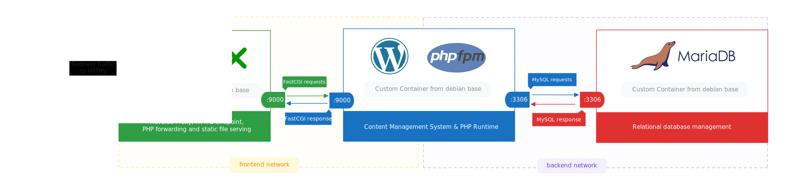
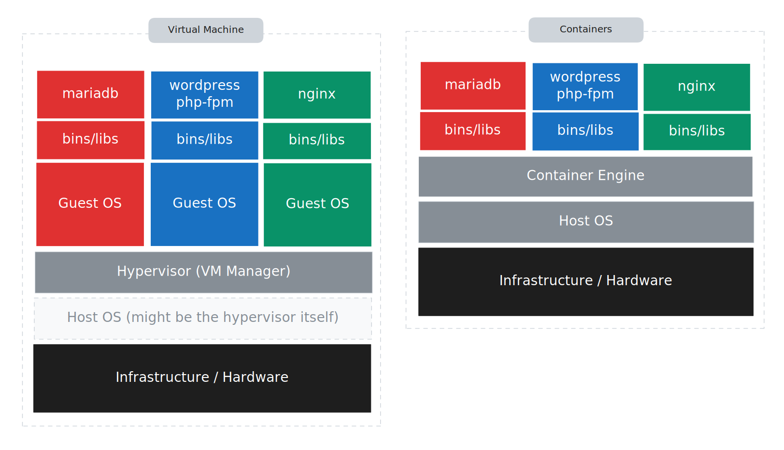

# Inception

- [Description](#description)
- [Virtual Machines vs Docker](#virtual-machines-vs-docker)
- [Docker Networks vs Host Network](#docker-networks-vs-host-network)
- [Docker Secrets vs Environment Variables](#docker-secrets-vs-environment-variables)
- [Docker Volumes vs Bind Mounts](#docker-volumes-vs-bind-mounts)
- [Instructions](#instructions)
	- [Prerequisites](#prerequisites)
	- [Running the stack](#running-the-stack)
- [Resources](#resources)
	- [Docker Core](#docker-core)
	- [Docker Compose](#docker-compose)
	- [Docker Security](#docker-security)
	- [Networking](#networking)
	- [NGINX](#nginx)
	- [MariaDB](#mariadb)
	- [WordPress](#wordpress)
	- [AI usage](#ai-usage)

## Project Description

The goal of this project is to get hands-on experience with containerization and orchestration by deploying a small but realistic web infrastructure using Docker Compose. Instead of installing NGINX, PHP, and MariaDB directly on a machine, each service lives in its own container built from a custom Dockerfile. The final result is a WordPress site served over HTTPS, with NGINX as the only public entry point, PHP-FPM processing WordPress application logic, and MariaDB for the managing of the WordPress MySQL database.

The three services, their roles, and how they connect:

| Service | Role | Port(s) | Volume |
|---|---|---|---|
| NGINX | Reverse proxy, endpoint for HTTPS traffic, serving static files and forwarding PHP to PHP-FPM | 443 | `wordpress_data`:`/var/www/dbarba-v` |
| WordPress + PHP-FPM | CMS, PHP runtime | 9000 (PHP-FPM) 3306 (MariaDB) | `wordpress_data`:`/var/www/dbarba-v` |
| MariaDB | Relational database management | 3306 | database files at `/var/lib/mysql` |

Everything is wired together in a single `docker-compose.yml`. Two user-defined networks enforce a clean separation: the `frontend` network connects NGINX to WordPress/PHP-FPM, and the `backend` network connects WordPress/PHP-FPM to MariaDB. NGINX has no route to the database, and the database is never exposed to the outside world.

### Virtual Machines vs Docker

You could run this same NGINX, PHP, MariaDB stack inside a VM, and it would work. But a VM boots a full operating system, with its own kernel, hardware drivers, and init system. That is a lot of overhead for three processes.

Docker containers share the host kernel; Docker uses Linux primitives like namespaces for isolation (what the process can see), cgroups for resource limits, and a union filesystem for layered images to give each container its own isolated environment without duplicating the OS. The result of this approach is that containers start in seconds, use less memory, and the images stay small because they only carry the application and its immediate dependencies.

For a project like this, where the goal is rapid iteration and reproducible environments, containers are the obvious fit. You can destroy the whole stack with one command and rebuild it from scratch in under a minute. Doing the same with VMs would be more time consumming and resource intensive.

### Docker Networks vs Host Network

By default, Docker can put all containers on a shared bridge network. The problem is that on the default bridge, containers can only reach each other by IP and those IPs are reassigned every time a container restarts, so hardcoding them is not a sustainable option.

Using `--network=host` would bypass Docker networking entirely and use the host’s networking stack directly (no virtual bridge, no NAT). That works, but it breaks isolation entirely.

User-defined bridge networks solve both problems. Docker's embedded DNS resolves container names to the right IP automatically, so `wordpress` can reference `mariadb` by name with no configuration. Each user-defined network is also its own isolated segment. Containers on different networks cannot talk to each other unless explicitly connected to both.

That is why this project uses two networks. NGINX sits on `frontend` and talks to WordPress. WordPress sits on both networks and talks to MariaDB over `backend`. MariaDB is on `backend` only and is completely unreachable from NGINX or the outside.

### Docker Secrets vs Environment Variables

A `.env` file contains a dictionary of key-value pairs used for general configurations like the domain name, port numbers of each service, or the name of the database, values that change across environments but are not sensitive. Compose interpolates them into the compose file at runtime, which makes the setup configurable without touching the compose file itself.

Credentials are a different story. Putting a database root password in a `.env` file means it ends up in the environment of every process that reads it, it might get accidentally committed to a repository, and it is visible to anyone who runs `docker inspect`. Docker Secrets are the solution for this, the secret is defined as a file on the host, Compose mounts it read-only inside the container at `/run/secrets/<name>`, and only the services explicitly granted access to it can see it. Nothing ends up in environment variables or image layers.

This project uses four secrets:

| Secret file | Purpose |
|---|---|
| `srcs/secrets/mariadb/mysql_root_password.secret` | MariaDB `root` password |
| `srcs/secrets/mariadb/mysql_wp_db_admin_password.secret` | Password for the WordPress database user (what PHP-FPM connects as, not root) |
| `srcs/secrets/wordpress-php/wp_admin_password.secret` | WordPress admin account password |
| `srcs/secrets/wordpress-php/wp_user_password.secret` | WordPress user account password |

### Docker Volumes vs Bind Mounts

For this setup we need data persistance across container restarts, rebuilds, etc and both volumes and bind mounts let a container write data that survives the container being stopped or removed. The difference is who manages the storage and how portable it is.

A bind mount mounts a file or directory from the host machine into a container. That works fine on your machine, but the moment someone else clones the repo and runs it, that path either does not exist or points to something completely different. The portability of the whole setup breaks.

Named volumes are managed by Docker. They live under Docker's own storage directory, they get created automatically when the stack starts, and work anywhere Docker is installed without dependency on the host paths. That is why this project uses named volumes for both the WordPress files and the MariaDB data directory. The stack is fully self-contained.

---

## Instructions

### Prerequisites

- Docker and Docker Compose installed
- Secret files created before starting the stack (see paths above)
- A `srcs/.env` edited with custom configurations

### Running the stack

The `Makefile` covers everything. Run `make help` to see the full list, but the most useful targets are:

| Command | Description |
|---|---|
| `make` / `make inception` | Build images and start all containers |
| `make up` | Start all containers in detached mode |
| `make down` | Stop and remove containers and networks |
| `make stop` | Stop running containers without removing them |
| `make restart` | Restart all containers |
| `make ps` | Show container status |
| `make shell SERVICE=<name>` | Open `/bin/sh` inside a running container |
| `make build` | Rebuild images (reads the configured `.env`) |
| `make config` | Print the resolved Compose configuration (good for debugging) |
| `make clean` | Remove containers and volumes |
| `make fclean` | Full cleanup — containers, volumes, and images |
| `make re` | Full rebuild (`fclean` + `all`) |

---

## Resources

### Docker Core

- [Docker Overview](https://docs.docker.com/get-started/docker-overview/) — Official Docker platform overview: architecture (client, daemon, registries), images, containers, and use cases.
- [OCI vs Docker — What is a Container?](https://www.theodo.com/en-fr/blog/oci-vs-docker-what-is-a-container) — Deep-dive on what a container is, Docker history, the OCI standard, and alternative container runtimes (runc, gVisor, Kata Containers).
- [Dockerfile reference](https://docs.docker.com/reference/dockerfile/) — Complete reference for all Dockerfile instructions: `FROM`, `RUN`, `CMD`, `COPY`, `ADD`, `ENTRYPOINT`, `ENV`, `EXPOSE`, `VOLUME`, `USER`, `WORKDIR`, `ARG`, and shell/exec forms.
- [Multi-stage builds](https://docs.docker.com/build/building/multi-stage/) — Using multiple `FROM` statements to produce lean final images containing only runtime artifacts, not build toolchains.
- [Dockerfile build best practices](https://docs.docker.com/build/building/best-practices/) — Best practices: base image selection, multi-stage builds, `ADD` vs `COPY`, cache-busting, and pinning image versions.
- [RUN vs CMD vs ENTRYPOINT](https://www.docker.com/blog/docker-best-practices-choosing-between-run-cmd-and-entrypoint/) — When to use each instruction; shell vs exec form; PID 1 and container signal handling.

### Docker Compose

- [Using secrets in Compose](https://docs.docker.com/compose/how-tos/use-secrets/) — How to define secret files, mount them at `/run/secrets/<name>`, and grant per-service access.
- [Setting environment variables](https://docs.docker.com/compose/how-tos/environment-variables/set-environment-variables/) — How to use the `environment` attribute and `env_file` attribute in Compose.
- [Environment variable best practices](https://docs.docker.com/compose/how-tos/environment-variables/best-practices/) — Keep secrets out of env vars; understand variable precedence and interpolation.

### Docker Security

- [Isolate containers with user namespaces](https://docs.docker.com/engine/security/userns-remap/) — User namespace remapping: map `root` inside a container to an unprivileged host user, limiting what a compromised container can do on the host.

### Networking

- [Docker Networking Tutorial, ALL Network Types explained!](https://www.youtube.com/watch?v=5grbXvV_DSk) — Video covering all Docker network types: bridge, host, overlay, macvlan, and none.

### NGINX

- [NGINX Beginner's Guide](https://nginx.org/en/docs/beginners_guide.html) — Start/stop/reload, configuration file structure (directives, contexts, blocks), static content serving, and reverse proxy setup.
- [NGINX Explained — What is Nginx](https://www.youtube.com/watch?v=iInUBOVeBCc) — Introductory video on NGINX as a web server, reverse proxy, and load balancer.
- [NGINX Directory Structure (Debian)](https://wiki.debian.org/Nginx/DirectoryStructure) — Layout of `/etc/nginx/`: `nginx.conf`, `conf.d/`, `sites-available/`, `sites-enabled/`, `snippets/`, and param files.
- [NGINX core module directives](https://nginx.org/en/docs/ngx_core_module.html) — Reference for core directives: `worker_processes`, `error_log`, `pid`, `events`, `user`, `include`, `load_module`.
- [Installing NGINX Open Source](https://docs.nginx.com/nginx/admin-guide/installing-nginx/installing-nginx-open-source/) — Installation from OS packages, the official nginx repo, or from source.
- [Configuring HTTPS servers](https://nginx.org/en/docs/http/configuring_https_servers.html) — `listen 443 ssl`, `certificate`, `certificate_key`, TLS protocol versions, SNI, and session cache.

### MariaDB

- [Installing MariaDB Server](https://mariadb.com/docs/server/mariadb-quickstart-guides/installing-mariadb-server-guide) — Install guide for Linux (apt/dnf/yum), `mariadb-secure-installation`, and service verification with systemctl.

### WordPress

- [Creating a database for WordPress](https://developer.wordpress.org/advanced-administration/before-install/creating-database/) — Creating the MySQL/MariaDB database via phpMyAdmin, the MySQL CLI, or hosting control panels.
- [How to install WordPress with LEMP on Ubuntu](https://www.digitalocean.com/community/tutorials/how-to-install-wordpress-with-lemp-on-ubuntu) — Full WordPress install on Nginx + MySQL/MariaDB + PHP: database setup, Nginx config, WordPress download, and web-based install.
- [How to install WordPress with WP-CLI](https://make.wordpress.org/cli/handbook/how-to/how-to-install/) — Installing WordPress from the CLI using `wp core download`, `wp config create`, `wp db create`, and `wp core install`.

### AI usage

- Restructuring and styling documentation.
- Fetching and summarising all linked resources to write accurate inline descriptions.
- [Dockerdocs AI Assistant](https://www.docker.com/blog/docker-documentation-ai-powered-assistant/) for docker related queries.
